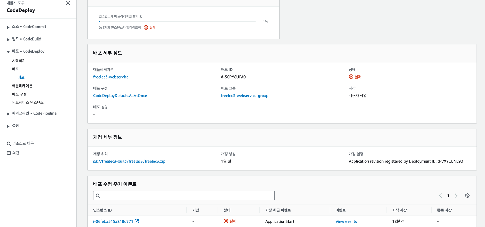
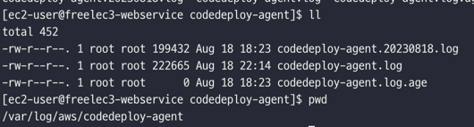

# freelec3

todo : 
  1. github action 연동 ( + slack 노티)
  2. 도커 멀티플랫폼 빌드
  3. node lib gradle 빌드
  4. 카카오 로그인 추가
  5. 실시간 알림 구현 (Server Sent Event) - 조회수, 좋아요, 댓글알림, 공지알림 등
  6. ~~세션 기반 로그인 -> jwt 로 바꿔보기 (트래픽 고려할것)~~
      - 사이즈(트래픽)
        - 토큰의 경우 사이즈가 크다
      - 안전성과 보안 문제
        - 세션은 서버에 저장, 토큰은 클라이언트에 저장
        - 토큰의 경우 payload 데이터를 누구나 볼 수 있음
      - 확장성
        - 서버 scale out 시 세션 불일치 문제에 세션은 따로 분리 작업 등을 해야함
      - 서버의 부담
        - 이용자가 많아질 수록 세션은 서버에 부담 증가
     
      > 소규모 서비스, 저사양 서버 -> 세션 기반  
        중/대규모 서비스, 여러대 서버 -> 토큰 기반
  

---

troubleshooting :
  1. ec2 배포 후 빌드 단계에서 멈춤 현상 (메모리부족. 스왑메모리 설정)  
     1. t2.micro 기준(램 1기가) 권장 스왑 파일은 2GB(128MB x 16)  
    ```$ sudo dd if=/dev/zero of=/swapfile bs=128M count=16```  
     2. 스왑 파일의 읽기 및 쓰기 권한을 업데이트    
    ```$ sudo chmod 600 /swapfile```  
     3. Linux 스왑 영역을 설정  
    ```$ sudo mkswap /swapfile```  
     4. 스왑 공간에 스왑 파일을 추가하여 스왑 파일을 즉시 사용할 수 있도록.  
     ```$ sudo swapon /swapfile```  
     5. 프로시저가 성공적인지 확인.  
     ```$ sudo swapon -s```  
     6. **/etc/fstab** 파일을 편집하여 부팅 시 스왑 파일을 시작.  
     ```$ sudo vi /etc/fstab```  
     
        파일 끝에 다음 줄을 새로 추가하고 파일을 저장한 다음 종료  
     ```/swapfile swap swap defaults 0 0```  
     
     - https://hjjooace.tistory.com/42  
     - https://kth022.tistory.com/15?category=1045193  
     - https://repost.aws/ko/knowledge-center/ec2-memory-swap-file

  2. 크롬에서 ec2 dns 로 접속 안됨. (https -> http)  
    - 크롬에서 https 권유 정책으로 바뀌면서 기본적으로 도메인 앞에 https 로 세팅됨. https -> http 로 변경 후 접속

  3. code deploy 배포 오류 시 로그 보는 방법  
     1. aws console 에서 확인  
          

     2. ```/var/log/aws/codedeploy-agent``` 에서 로그 확인 가능  
       

     3. ```/opt/codedeploy-agent/deployment-root``` 에서 code deploy 로그 확인 가능
        echo 확인 가능
     